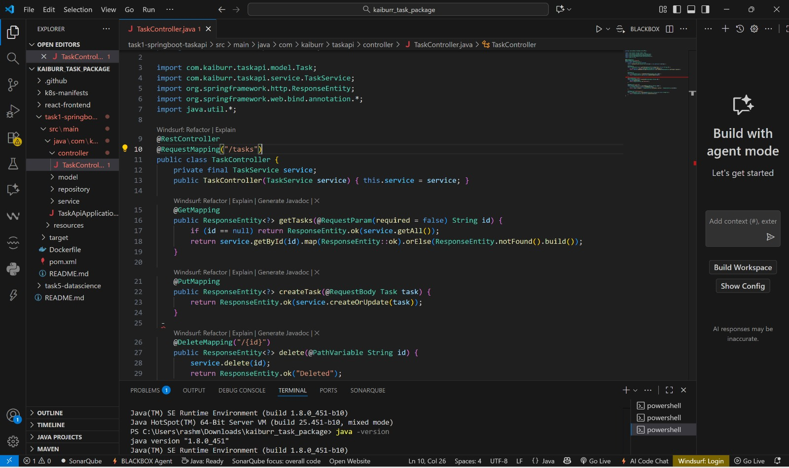
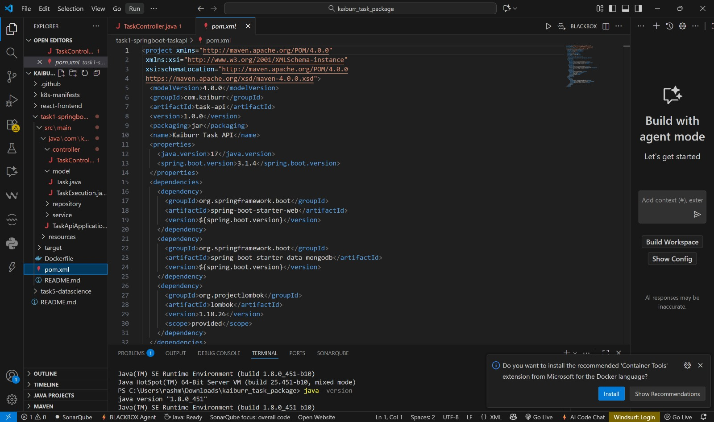

# Kaiburr Assessment Package

## Contains:
- **task1-springboot-taskapi/** – Complete Spring Boot app  
- **k8s-manifests/** – Kubernetes manifests for Task 2  
- **react-frontend/** – Skeleton for Task 3  
- **.github/workflows/ci.yml** – CI/CD skeleton for Task 4  
- **task5-datascience/** – Skeleton for Task 5  

I cannot run the app or take screenshots for you, but this package includes everything you need to run locally and produce the required screenshots for submission.
